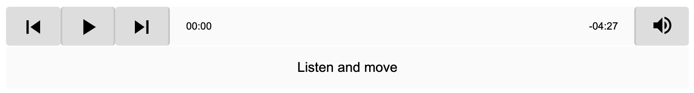

# Modules to install
```
> npm i ngx-audio-player --save
> npm i @angular/material --save
> npm i @angular/cdk --save
```

# Import NgxAudioPlayerModule to app.module.ts
```import { NgxAudioPlayerModule } from 'ngx-audio-player';

imports: [
    ..., NgxAudioPlayerModule
  ],
  
```
## output



# AngularAudioPlayerDemo

This project was generated with [Angular CLI](https://github.com/angular/angular-cli) version 9.1.0.

## Development server

Run `ng serve` for a dev server. Navigate to `http://localhost:4200/`. The app will automatically reload if you change any of the source files.